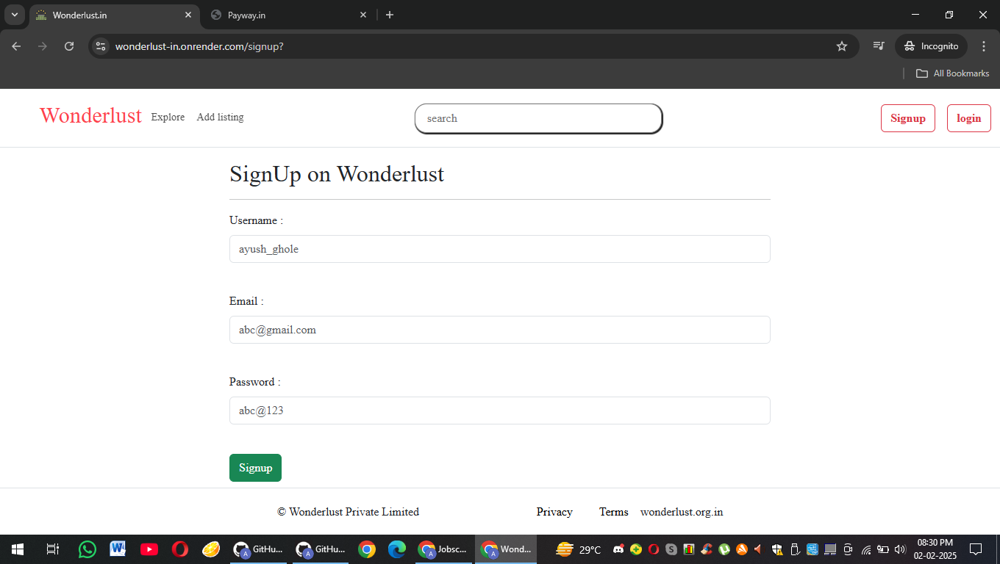
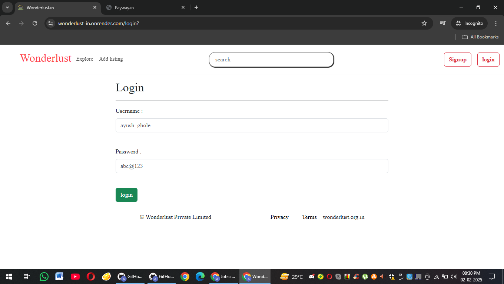
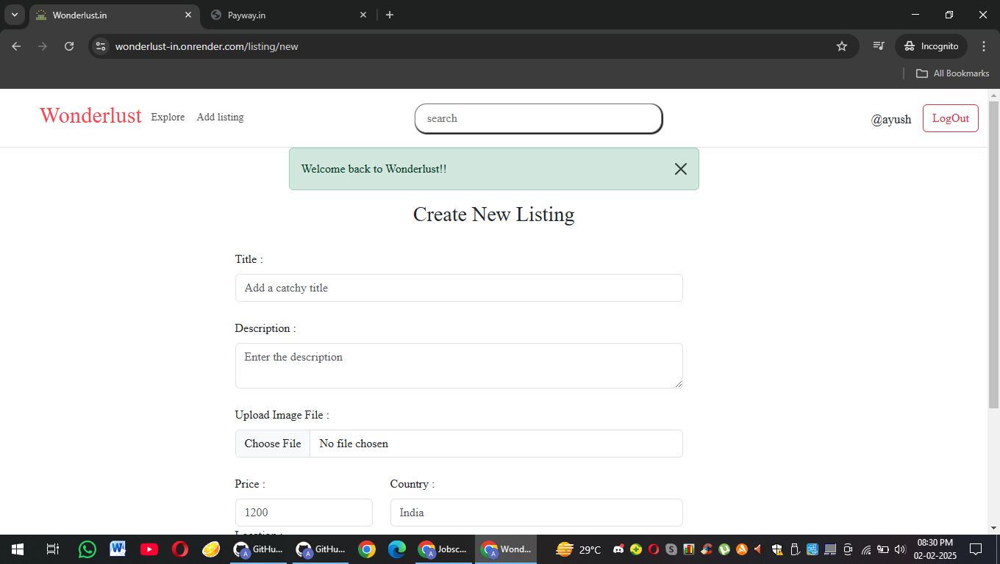
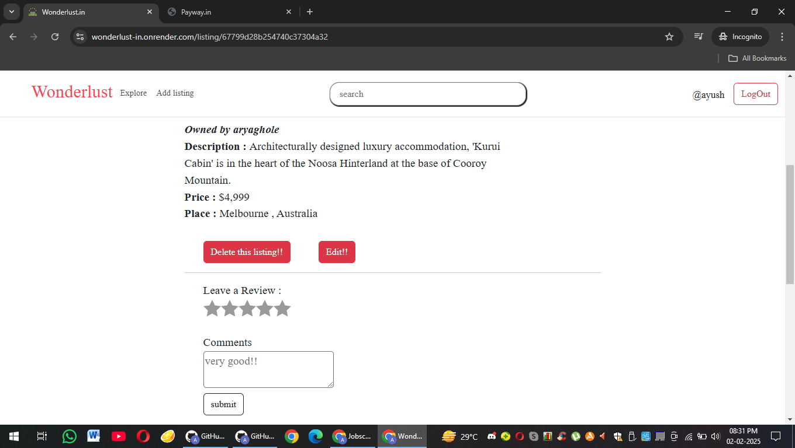

<b>Descritption : </b> 
Wanderlust Web is a dynamic and user-friendly travel accommodation platform, similar to Airbnb, designed for explorers seeking unique stays and memorable experiences. Whether you're looking for cozy cabins, luxurious villas, or budget-friendly apartments, Wanderlust Web connects travelers with verified hosts worldwide. With an intuitive search interface, secure booking system, and personalized recommendations, users can effortlessly find the perfect stay. The platform also offers features like guest reviews, seamless communication with hosts, and flexible payment options, ensuring a hassle-free travel experience. Whether planning a weekend getaway or a long-term stay, Wanderlust Web transforms travel dreams into reality.

 
<b>Main Page  : </b> 

<b>Sign Up Page : </b> 

 
<b>Login Page : </b>  
 

 
<b>Build Technologies : </b> 
Wanderlust Web is a travel accommodation platform built using the MERN stack (MongoDB, Express.js, React, and Node.js), ensuring a seamless and responsive user experience. The frontend is developed with React.js for dynamic UI rendering, utilizing Bootstrap via CDN links for a sleek and modern design. The backend is powered by Node.js and Express.js, handling authentication, user management, and booking processes efficiently. MongoDB serves as the database, storing user profiles, listings, bookings, and reviews securely. The platform includes essential features such as search functionality, secure authentication (JWT), booking system, payment integration, and real-time messaging. With a clean, responsive design and optimized performance, Wanderlust Web provides a hassle-free experience for both travelers and hosts.

 
<b>Create Lisitng  Page : </b>  
 

 
<b>Challenges  : </b> 
 
Challenges Tackled While Building Wanderlust Web 
Authentication & Security 
 
Implementing secure passport-based authentication for user login and session management.
Handling OAuth (Google, Facebook login integration) for a smoother sign-in experience.
Preventing unauthorized access, CSRF, and XSS attacks by implementing proper security measures.
Scalability & Performance
 
Optimizing MongoDB queries to handle large datasets efficiently. 
Implementing pagination and indexing for faster search and filtering of properties.< 
Using server-side rendering (SSR) in Next.js (if applied) or lazy loading in React for improved page load speeds. 
Real-Time Features
 
Ensuring smooth updates for booking availability and notifications.
Payment Integration
 
Responsive UI & Design Consistency
 
Utilizing Bootstrap (via CDN links) for a mobile-friendly and aesthetically pleasing UI.
Ensuring smooth navigation and interactive elements across devices.
 
Deploying the backend on Vercel, Render, or AWS for high availability.
Using MongoDB Atlas for cloud-based database management.
Setting up CI/CD pipelines for automated deployments and updates. 

User Reviews & Ratings 
Handling spam detection and preventing fake reviews.
Allowing users to edit or delete their reviews securely.
State Management & Component Optimization
 

<b>Review Page : </b> 

<b>Skills Section : </b> 
 

 
<h3>Deployed Project Link : </h3>
 
 
  
    
   <h4>Demo Link : </h4> 
    
     
